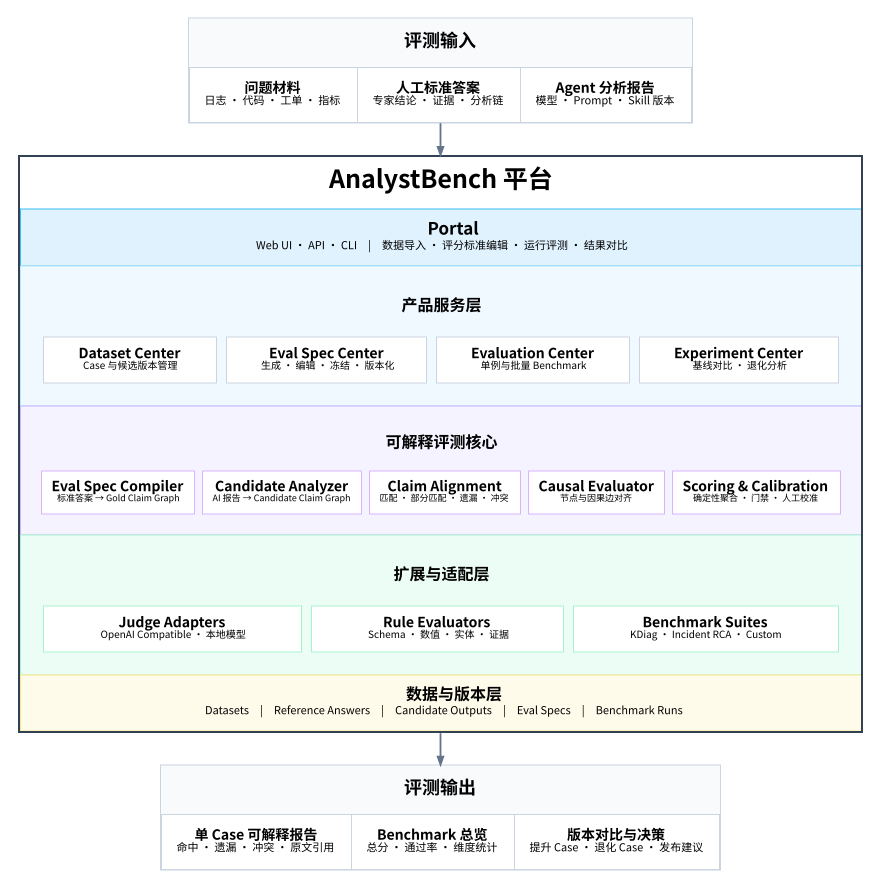

<div align="center">

# AnalystBench

### 让开放式问题分析报告，可被拆解、可被评估、可被比较

面向问题分析型 Agent 的开源 Benchmark 平台  
**标准答案结构化 · 可解释评分 · 批量评测 · 版本对比**


</div>

---

## 什么是 AnalystBench？

随着 Agent 被用于故障诊断、代码分析、安全分析和专业报告生成，开发者逐渐遇到同一个问题：

- 人工标准答案是自然语言；
- Agent 输出也是自然语言；
- 两者即使表达不同，也可能语义等价；
- 报告即使写得很长，也可能只识别了表面现象；
- 模型、Prompt 或 Skill 升级后，很难证明效果是否真正提升。

传统文本相似度无法判断根因、证据和因果关系；让 LLM 直接阅读两篇报告后给一个总分，又容易产生评分黑盒和结果波动。

**AnalystBench 正是为解决这一问题而生。**

它将人工标准答案转换为可编辑的 **Eval Spec**，将 Agent 报告转换为原子化 **Claim Graph**，再对关键结论、证据和因果关系进行逐项对齐，形成可追溯、可复现的 Benchmark 结果。

> 与直接使用通用 LLM Judge 不同，AnalystBench 将“评分标准生成、语义对齐和最终计分”分离：  
> **LLM 负责理解语义，确定性代码负责执行评分。**

---

## ✨ 核心能力

- **自然语言评分标准生成**  
  将专家标准答案拆解为核心结论、直接触发原因、症状、定位结果、证据、因果关系和行动建议，生成可编辑、可冻结的 Eval Spec。

- **可解释的报告评分**  
  从 Agent 报告中提取原子 Claim，并逐项判断 `match`、`partial_match`、`missing`、`contradiction`，每个结果都绑定报告原文和评分理由。

- **因果链评测**  
  不只检查关键词和结论是否出现，还判断“根因 → 机制 → 现象 → 影响”的因果关系是否完整、遗漏或反向。

- **批量 Benchmark 与版本对比**  
  使用同一数据集和评分标准，对比不同模型、Prompt、Agent 或 Skill 版本，定位提升 Case、退化 Case 和新增错误结论。

- **Skill 自优化（实验功能）**
  从用户配置的本地 Skill 目录导入不可变版本，在隔离工作区中运行基线与候选版本，使用重复 Benchmark、配对比较和 Gate 决定是否更新 Active 版本。版本保存在 AnalystBench 自己管理的内部 Git 中，不修改用户源目录或用户仓库。

- **claude 与 OpenCode 直接执行**
  通过本地后台任务调用 `claude -p` 和 `opencode run` 生成 Candidate Report，同时继续支持导入已有报告。首版只评分最终报告，执行事件保留用于审计和后续 Trace Evaluation。

- **领域 Benchmark Suite**  
  核心框架保持领域无关，通过 Suite 扩展领域模板、确定性规则和示例数据集。首个官方套件为内核问题分析 `KDiag Suite`。

- **本地优先、自托管**  
  平台数据保存在用户环境中；确定性评测可以离线执行，语义 Judge 可接入本地模型或用户自己的 OpenAI-compatible 服务。

---

## 🏗️ 整体架构

<p align="center">
  
</p>

AnalystBench 由五层能力构成：

1. **Portal**：通过 Web UI、API 或 CLI 导入数据、编辑标准、运行评测和查看对比；
2. **产品服务层**：管理 Dataset、Eval Spec、Evaluation Run 和 Experiment；
3. **可解释评测核心**：完成标准答案编译、候选报告抽取、Claim 对齐、因果链评价和分数聚合；
4. **扩展与适配层**：接入不同 Judge、确定性规则和领域 Benchmark Suite；
5. **数据与版本层**：保存数据集、标准答案、候选输出、Eval Spec 和 Benchmark Run 的完整版本信息。

---

## 工作流程

```text
问题材料 + 人工标准答案
              │
              ▼
     生成并确认 Eval Spec
              │
Agent 报告 ───┼──→ Candidate Claim 抽取
              │
              ▼
   Claim 对齐 + 因果关系对齐
              │
              ▼
     确定性聚合与门禁规则
              │
              ▼
单 Case 报告 + Benchmark 总览 + 版本对比
```

### 1. 创建评测数据集

每条 Case 至少包含：

- 问题描述或原始材料；
- 人工分析标准答案；
- 一个或多个 Agent 分析报告。

问题材料可以是日志、代码、工单、指标、堆栈、事件记录或其他附件。

### 2. 生成 Eval Spec

平台从标准答案中生成评分标准草稿，包括：

- 核心结论或根因；
- 直接触发原因；
- 症状和定位结果；
- 必须覆盖的关键 Claim；
- Claim 之间的因果关系；
- 已知常见误判；
- 权重、门禁和通过阈值。

用户确认后，Eval Spec 被版本化并冻结，用于正式 Benchmark。

### 3. 评分 Agent 报告

平台将 Agent 报告提取为 Candidate Claims，并与 Gold Claims 逐项对齐：

| 关系 | 含义 |
|---|---|
| `match` | 核心含义一致 |
| `partial_match` | 方向正确，但缺少关键机制或限定条件 |
| `missing` | Agent 报告没有表达该结论 |
| `contradiction` | Agent 明确提出与标准答案冲突的结论 |

LLM Judge 只负责关系判断，最终权重、扣分和总分由评分引擎计算。

### 4. 运行 Benchmark

批量执行后，平台输出：

- 综合得分和通过率；
- 核心结论命中率；
- 关键 Claim 覆盖率；
- 因果关系完整性；
- 遗漏项和冲突结论；
- 各版本的提升与退化 Case。

---

## 评测对象

AnalystBench 适合评价需要输出开放式分析报告的 Agent：

| 场景 | 示例 |
|---|---|
| 故障与事故 RCA | 生产事故、系统故障、服务异常 |
| 内核与操作系统分析 | panic、hang、调度、内存和驱动问题 |
| 代码问题分析 | 缺陷定位、设计评审、迁移问题分析 |
| 安全分析 | 漏洞成因、攻击链和风险分析 |
| 质量与客诉分析 | 产品质量、售后和用户反馈归因 |
| 专业研究报告 | 技术调研、实验结论和行业分析 |

---

## Benchmark Suites

AnalystBench Core 不绑定具体领域。领域能力通过 Suite 提供：

```text
AnalystBench Core
├── Generic Analysis Suite
├── Incident RCA Suite
├── Code Analysis Suite
├── Security Analysis Suite
└── KDiag Suite
    └── 内核与操作系统问题分析
```

### KDiag Suite

`KDiag Suite` 是首个官方领域套件，计划提供：

- 内核问题 Eval Spec 模板；
- panic、hang、OOM、调度和驱动问题示例；
- 函数、线程、调用栈和日志证据检查规则；
- 内核问题分析示例数据集；
- Sherlock Agent 的版本对比案例。

---

## 为什么不是简单的 LLM 打分？

AnalystBench 不采用以下方式作为核心评分方法：

```text
标准答案 + Agent 报告
          ↓
“请给出 0～100 分”
```

因为这种方法存在：

- 评分标准隐含；
- 不同 Judge 的分数不可直接比较；
- 长报告容易因表达丰富获得虚高分；
- 无法区分表面触发原因和底层根因；
- 很难解释具体遗漏和错误；
- Prompt 或模型变化会造成评分漂移。

AnalystBench 使用以下中间表示：

```text
Reference Answer → Gold Claim Graph
Agent Report     → Candidate Claim Graph
```

再通过节点对齐、因果边对齐、冲突惩罚和人工校准完成评分。

---

## 第一阶段范围

AnalystBench 第一阶段聚焦 **最终结果 Benchmark**：

- 数据集与 Candidate 版本管理；
- claude 与 OpenCode CLI 的轻量执行集成；
- 自然语言标准答案转 Eval Spec；
- Candidate Claim 抽取；
- Claim 和因果关系对齐；
- 可解释评分；
- 批量 Benchmark；
- A/B 版本对比。

第一阶段暂不负责：

- 通用 Agent 托管、复杂编排或远程执行集群；
- 标准化或评分 Agent Trace；
- 接收 OTLP 数据；
- 评价工具调用和执行过程；
- 未经版本冻结、重复评测和 Gate 直接覆盖或发布用户源 Skill。

当前仓库已经提供实验性的 Skill 自优化闭环：本地 Skill 导入、内部 Git
版本、结构化 Patch、隔离运行、每轮两个候选、Screening、三次重复验证、
灰区 5/7 次增采样、Family/Dimension Evidence、配对 Gate、Early Stop、
Run Group 恢复复用、Active 晋升与回滚，并提供专用前端。

仓库内已有并发隔离的 `/skill` 命令契约 E2E。真实 claude E2E 会自动发现
PATH 中的 `claude`，也可通过环境变量指定；这项环境验收和真实四 Case 先导实验不会
被替身测试冒充。

其余能力将在结果评测和 Skill 自优化纵切稳定后继续扩展。

---

## 项目路线

### Phase 1：Result Benchmark + Execution Integration Lite

完成自然语言标准答案到可执行评分标准的闭环，支持已有 Agent 报告批量评分，并可通过 claude/OpenCode CLI 后台生成 Candidate Report。

### Phase 2：Execution Integration

扩展更多 Agent Adapter、远程执行环境、复杂执行策略与持续回归触发。

### Phase 3：Trace & Agent Evaluation

接入运行轨迹，评价规划、工具调用、步骤效率和执行可靠性。

### Phase 4：EvalOps

支持生产 Case 回流、人工校准、评分漂移检测和 Agent/Skill 发布门禁。

---

## 项目状态

AnalystBench 当前处于 MVP 开发阶段。已完成的能力和运行方式以当前代码、
测试和运行手册为准。Skill 自优化的本地代码闭环已经实现；真实 claude
二进制验收、用户私有 Case 实验和研究结论必须在用户自己的私有环境运行，
仓库中的确定性测试不能替代这部分证据。

## 快速开始

需要 Python 3.12 及以上版本。根据使用场景选择路径：

### 单次打分与测评（不需要数据库）

适合：只有一份 Case JSON 和几份报告，评分一次出结果就走。

```bash
python3 -m venv .venv
.venv/bin/pip install -e ".[dev]"
.venv/bin/analystbench evaluate ./case/case-1.json ./case/test-1-agent-1.md ./case/test-1-skill-1.md
```

结果输出到 `data/results/`，不写入数据库。完整流程见[快速上手](docs/quickstart.md)。

### 数据库部署与前端支持

适合：需要版本管理、批量评测、前端 UI 或后台 Worker。

```bash
python3 -m venv .venv
.venv/bin/pip install -e ".[dev]"
.venv/bin/analystbench serve         # 升级数据库并启动 API + Worker
```

不希望终端持续占用时，可以后台启动：

```bash
.venv/bin/analystbench serve --detach
.venv/bin/analystbench service status
.venv/bin/analystbench service logs  # 输出日志文件路径
.venv/bin/analystbench service stop
```

API 文档位于 `http://127.0.0.1:8000/docs`，就绪探针位于 `/api/v1/health/ready`。
后台启动默认等待 API 就绪 60 秒；较慢机器可增加
`--startup-timeout 120`，就绪探测始终直连本机、不经过 HTTP 代理。
`api`、`worker` 和 `db-upgrade` 命令仍保留，供调试或拆分部署使用。

部署、备份、恢复与安全说明见[运维文档](docs/operations.md)。

### Skill 自优化（实验功能）

先在 `.env.local` 开启：

```dotenv
ANALYSTBENCH_SKILL_OPTIMIZATION_ENABLED=true
ANALYSTBENCH_SKILL_OPTIMIZATION_MANAGED_ROOT=/absolute/path/to/analystbench-skill-optimization
```

`MANAGED_ROOT` 必须显式配置为已存在、可写的绝对路径；它保存 AnalystBench
管理的不可变 Skill 版本和内部 Git，不要指向用户源 Skill 或 AnalystBench
源码仓库。

Linux/WSL 私有验收还需安装且允许 Worker 运行 `bubblewrap`；
`preflight --strict` 会实际探测 namespace。Optimizer、Target 和 Judge 使用
每次命令自己的临时 HOME/XDG 目录，因此普通用户 HOME 中的交互式 CLI
登录不会自动复制；详细认证与沙箱边界见运行手册。

再启动后端与前端：

```bash
.venv/bin/analystbench serve
cd src/frontend && npm install && npm run serve
```

打开 `http://127.0.0.1:5173/skill-optimization`，通过三步向导配置：

1. **Skill**：从冻结 Harness 的
   `skill_base_dir/skills/<skill-key>` 导入本地 Skill 和初始不可变版本；
   调用名自动为 `/<skill-key>`；
2. **Benchmark**：选择命令中包含 `/skill-key` 的冻结 Evaluation
   Target，并选择 `development_regression` 或在页面划分
   Train/Validation/Hidden/Prospective 的 `independent_validation`；
3. **Gate**：创建冻结 Optimizer Profile、Policy 和 Verifier，设置门禁并启动
   Experiment。`independent_validation` 固定只运行一个 Epoch；
   Hidden/Prospective 只冻结和隔离，不由当前闭环自动运行。

优化器不会直接编辑源 Skill。候选只在 Managed Root 中形成新的不可变副本；
只有分数与硬约束 Gate 都通过的候选才会原子切换为该 Target 的 Active。
之后按 Target 发起的普通评测会解析运行时 Active 并冻结到该 Submission；
已完成的历史评测不会随 Active 切换或回滚而改变。
当前 Optimizer 使用同一冻结 claude Profile 执行
failure/success/generalization/simplification 四角色 Train-only 分析，
只接受严格结构化、受编辑预算约束的 Patch，不直接修改任何源目录。
每个 Epoch 的修改内容、基线/候选分数、正负 Delta、逐 Case/Family/Dimension
变化、Gate 原因和 Active 决策都会进入持久化总账。

开发模式下 4 个 Case 会全部参与 Evidence 和 Screening。两个候选中选出一个
进入三次完整验证时，每个 Epoch 最多产生 36 份目标 Agent 报告；Optimizer
和每份报告的 Judge 调用另计。灰区会
继续追加到 5/7 次。第一次建议设置 `max_epochs=1`。最短操作流程和结果判断见
[快速上手：路径 C](docs/quickstart.md#skill-optimization-quickstart)。
私有环境从配置、预检、运行、导出到回滚的完整步骤见
[Skill 自优化运行手册](docs/skill-optimization-runbook.md)。

---

## 用户文档

- [文档导航](docs/README.md) — 用户文档与内部资料的目录边界
- [快速上手](docs/quickstart.md) — 单次评分、数据库部署与 Skill 自优化指南
- [Skill 自优化运行手册](docs/skill-optimization-runbook.md) — 私有环境配置、预检、运行、总账、导出、回滚与验收
- [评分输入格式说明](docs/scoring-input.md) — Case JSON 字段、评分策略、AI 报告格式
- [AnalystBench Skills 说明](docs/skills.md) — 4 个 claude Skill 说明
- [命令行工作流](docs/cli-workflow.md) — 数据库模式完整 CLI 流程
- [运维与恢复](docs/operations.md) — 本地部署、服务管理、备份和恢复
- [Benchmark Suite 设计](docs/benchmark-suites.md)

## 开发与调研资料

- [Agent 开发文档](docs/development/README.md)
- [Benchmark 调研](docs/benchmark/README.md)
- [Skill 自优化调研](docs/skillopt/README.md)
